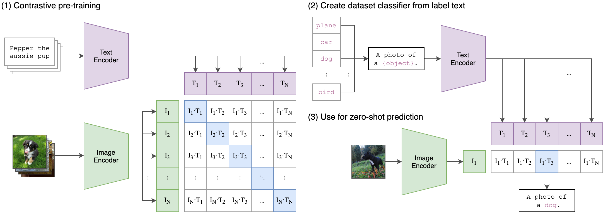

# Image Understanding Game with CLIP and Streamlit

This repository contains a Streamlit web application that allows users to play a game called "Two Truths and One Lie" with images. The game uses OpenAI's CLIP (Contrastive Language-Image Pre-training) model to understand and evaluate user-provided descriptions against an uploaded image.

You can try out the app here - https://clipgame.streamlit.app/

## What is CLIP?



CLIP (Contrastive Language-Image Pre-Training) is a cutting-edge deep learning model developed by OpenAI that bridges the gap between vision and language by learning visual concepts from natural language descriptions. Unlike traditional models that rely on labeled datasets, CLIP leverages a vast amount of internet data, training on pairs of images and their associated texts. This enables the model to perform zero-shot learning, recognizing objects and scenes without explicit training for specific tasks. By employing a contrastive loss, CLIP aligns image and text representations in a shared embedding space, making it highly versatile for applications in image classification, retrieval, and beyond.


## How It Works

The application lets users upload an image and then enter three descriptions about the image, where two descriptions are true and one is false (the lie). The CLIP model then evaluates these descriptions against the image to predict which description it believes to be the most likely true statement.

### Technologies Used

- **Streamlit**: Used for building the interactive web application interface.
- **CLIP (Contrastive Language-Image Pre-training)**: Utilized for encoding images and text and for predicting descriptions based on the uploaded image.
- **PyTorch**: Used as the deep learning framework to run the CLIP model.
- **PIL (Python Imaging Library)**: Used for handling image input and output.

## Local setup instructions

1. Clone the repository:

   ```bash
   git clone https://github.com/your-username/clip_game.git
   cd clip_game
   ```

2. Install dependencies:

   ```bash
   pip install -r requirements.txt
   ```

3. Run the Streamlit app:

   ```bash
   streamlit run app.py
   ```

4. Open your browser and navigate to the localhost URL to use the application.

## Usage

- Upload an image using the provided file uploader.
- Enter three descriptions about the image, where two are false statements and one is true.
- Click the "Guess" button to see which description the CLIP model predicts as the most likely true statement.
- The application displays the predicted description and its confidence level.

## Additional materials
- [openai-clip github](https://github.com/openai/CLIP)

## References
- [Learning Transferable Visual Models From Natural Language Supervision](https://arxiv.org/pdf/2103.00020v1.pdf)
- [Hierarchical Text-Conditional Image Generation with CLIP Latents](https://arxiv.org/pdf/2204.06125v1.pdf)